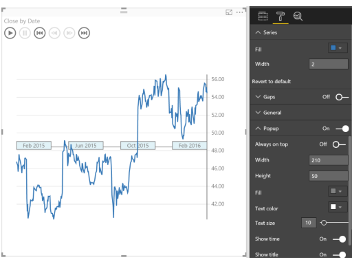

# HealthNexus
 

> Line chart annotated with key events. Perfect for story telling with data.

# Overview

The core vision of our project is to harness cutting-edge analytics and AI to transform healthcare diagnostics and treatment optimization. Addressing the pivotal challenges of early disease detection and personalized treatment recommendations, we deploy an advanced predictive analytics platform powered by Azure Synapse Analytics, Azure Machine Learning, and Azure Data Factory.

Azure Synapse Analytics processes vast datasets, integrating diverse sources like electronic health records (EHRs), medical imaging, and genomic data to construct comprehensive patient profiles. Azure Machine Learning develops sophisticated AI models trained on extensive historical patient data to predict disease onset and tailor treatment plans. Meanwhile, Azure Data Factory orchestrates seamless data workflows, ensuring efficient data movement and transformation.

Incorporating Azure Health Bot as an AI-driven diagnostic assistant, we enable preliminary assessments based on symptoms and medical history, guiding further diagnostic tests or treatments. Additionally, Azure Cognitive Services enhance the platform with advanced natural language processing, interpreting unstructured clinical data for improved diagnostic accuracy and recommendations.

By leveraging Azure's robust data processing and AI capabilities, our project addresses the pressing need for accurate and timely healthcare diagnostics. This innovative solution promises to empower healthcare providers with enhanced decision-making capabilities, leading to improved patient outcomes and optimized resource utilization. Designed for scalability, security, and seamless integration, our approach ensures widespread applicability and ease of adoption across the healthcare industry.

See also [Pulse Chart at Microsoft AppSource](https://appsource.microsoft.com/en-us/product/power-bi-visuals/WA104381006)
